<h3 align="center"><samp>Hello! I'm <b><a rel="nofollow noopener noreferrer" target="_blank" href="">Cristian J. Ambrosi</a></b></samp></h3>

 
  <samp>
    「 Bachelor's degree in Computer Science 」 
  </samp>

 
<samp>
  

    ════ ⋆★⋆ ════ 
    From <a href="https://github.com/cjambrosi">cjambrosi</a>
  

</samp>
 

<!--  -->
<!--  -->
<!--  -->

